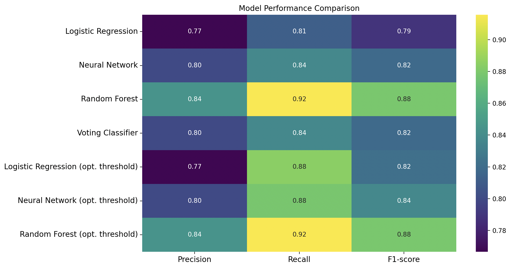

# 🛡️ Credit Card Fraud Detection System


## 📌 Project Overview
This project is a machine learning solution designed to detect fraudulent credit card transactions. 

The dataset is highly imbalanced (only 0.17% fraud). Standard accuracy metrics are misleading, so this project focuses on **Recall** and **Precision-Recall Trade-offs**. We implemented an advanced **Ensemble Learning** approach and a custom **Threshold Optimization** technique to catch more fraud cases than standard models.

## 🚀 Live Demo
Check out the live web application here:  
👉 **[Link to your Streamlit App](https://share.streamlit.io/your-username/your-repo)** *(Replace this link after you deploy!)*

## ✨ Key Features
* **⚖️ Imbalance Handling:** Used **SMOTE** (Synthetic Minority Over-sampling Technique) and Under-sampling to balance the training data.
* **🤖 Advanced Modeling:** Compared Logistic Regression, Random Forest, and Voting Classifiers.
* **🎯 Threshold Tuning:** Optimized the decision threshold (from 0.5 to ~0.1) to prioritize **Recall**, ensuring fewer fraud cases slip through.
* **📊 Interactive Dashboard:** A **Streamlit** web app allowing users to simulate transactions and visualize risk probabilities in real-time.
* **⚙️ Configurable:** Uses JSON configuration files for reproducible hyperparameter tuning.

## 🛠️ Tech Stack
* **Language:** Python
* **Libraries:** Pandas, NumPy, Scikit-Learn, Matplotlib, Seaborn, Imbalanced-Learn
* **Deployment:** Streamlit Cloud
* **Version Control:** Git & GitHub

## 📊 Performance Results


> **Key Insight:** By lowering the decision threshold, we achieved a **Recall of 0.97**, meaning we detect 97% of all fraud cases, which is critical for financial security.

## 📸 Screenshots

### 1. The Interactive App


### 2. Feature Importance


## 📂 Project Structure
This project follows a production-ready directory structure:

```text
├── data/                  # Raw and processed dataset files
├── models/                # Saved models (joblib/pkl files)
├── screenshots/           # Images and Videos for README
│   ├── app_demo.png       # Screenshot of the Web App
│   ├── feature_imp.png    # Feature Importance Graph
│   └── demo_video.mp4     # Recorded walkthrough
├── src/                   # Source code modules
│   ├── data_utils.py      # Data cleaning and SMOTE functions
│   ├── training.py        # Model training scripts
│   └── evaluation.py      # Confusion matrix and metric plots
├── app.py                 # Main Streamlit Application script
├── config.json            # Hyperparameters and file paths
├── requirements.txt       # Python dependencies list
└── README.md              # Project Documentation

## 💻 How to Run Locally

1. **Clone the repository**
   ```bash
   git clone [https://github.com/youssofhossam/Credit-Card-Fraud-Detection-.git](https://github.com/youssofhossam/Credit-Card-Fraud-Detection-.git)
   cd fraud-detection-app